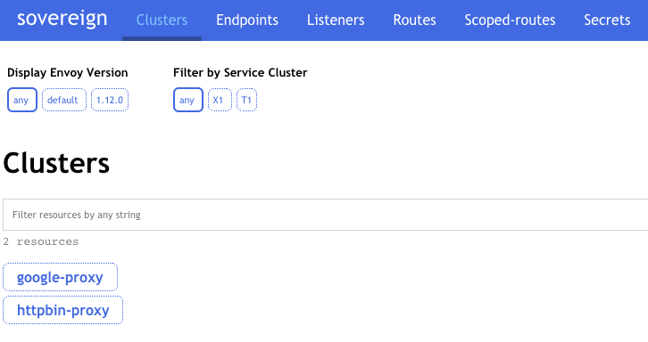

Sovereign is a JSON control-plane for Lyft's Envoy proxy.  
A control-plane communicates with Envoy using the XDS protocol in order to supply it with configuration.

Sovereign is written to be **simple** and **extensible** so that you can start basic and increase customizations when needed.

---

### Requirements

* Some knowledge of Envoy
* Python 3.8+

---

### Features

* **Flexible data input**: Using `sources` sovereign can retrieve data from anywhere, whether it be over HTTP, file, inline, or some other format.
* **Node Matching**: Sovereign can decide which configuration is provided to an Envoy based on an element of the discovery request.
* **User Interface**: A read-only web interface is supplied so that you can view the resources served by the control-plane.

