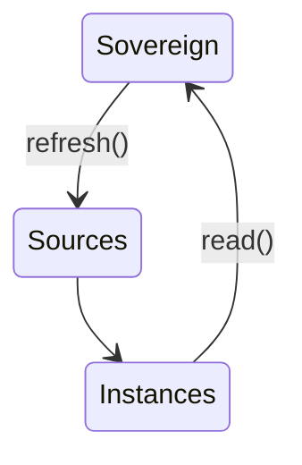
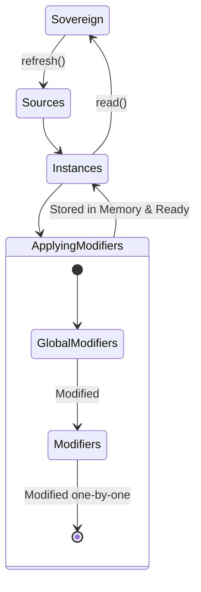
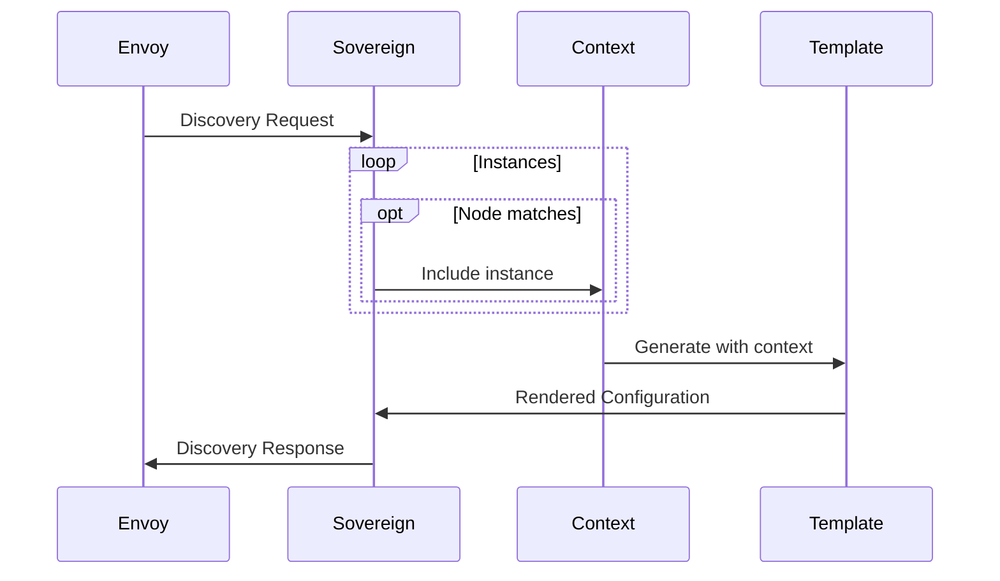

# Terminology

### Sources

The standard way of informing Sovereign where it should retrieve data from.  
A source should return [Instances](#instances).

Sovereign has a few builtin Source types, one being `file` which can be a file either locally or a file over HTTP.

The other builtin Source type is `inline`, which has to be included in the main configuration file for Sovereign as YAML
and is less dynamic (it can't be changed without restarting Sovereign whereas a file/http source can).

#### Scopes

Every Source has a "scope". Scopes allow each source to specify which resource types it is available to.

For example, you could have a source that specifies the clusters for your envoy proxies, and another that specifies the listeners.  
By scoping each source to their respective resource type, you don't need to use conditional logic to filter data within your [Templates](#templates).

### Instances

When a Source is polled for data, it is expected that the data returned is a list of key:value mappings.  
Each key:value mapping is considered an instance.

```json
// Instances
[
  // One instance
  { 
    "fqdn": "example",
    "port": 8081
  }
]
```

Instances are used within templates to generate configuration for Envoy.  
One such example might be creating one cluster, virtual host, listener, etc for each instance.

Sovereign continuously refreshes instances in a background thread, on a configurable schedule.



### Modifiers

Modifiers are the plugin system for Sovereign which will apply 
some kind of 'modification' to instances before they are used to generate configuration.

There are currently two types of modifiers: 'modifier' and 'global modifier'

The difference between these is that the Global Modifier has access to the entire set of instances, so it can apply 
changes which span across several individual instances, whereas a modifier is only supplied one instance at a time.

Modifiers are applied _after_ Global Modifiers.

Building on the previous diagram in [Instances](#instances), modifiers fit into the process as follows:



### Node

Individual Envoy proxies are referred to as Nodes, because as part of the [Discovery Request](#discovery-request) they will include
a 'node' field which identifies the proxy in some way.

This information is then used to perform 'node matching' which allows Sovereign to supply different configuration to
different groups of proxies, by controlling which [Instances](#instances) are used as [Context](#context).

### Node Matching

Sovereign was designed to be able to serve configuration to multiple separate logical groups of Envoy proxies.

The way that Sovereign is able to distinguish between different Envoys is by 
comparing a key in the [Node](#node), with a key in each [Instance](#instances).

By default, Sovereign checks if the Node contains a key `clusters` which matches a key `service_clusters` in the Instance.  
If either key contains `*`, it is considered a match.

For more information on setting up Node matching to suit your needs, see #TODO

!!! note
    This is optional and can be disabled by 

### XDS

Envoy uses the XDS protocol to discover the resources that it should configure.

More information can be found in the [Envoy documentation](https://www.envoyproxy.io/docs/envoy/latest/api-docs/xds_protocol)

### Discovery Request

This is the XDS mechanism by which an Envoy proxy requests configuration from a control-plane, such as Sovereign.

!!! example

    ```json
    HTTP POST /v2/discovery:<resource_type>
    Host: sovereign
    
    {
        "node": {
          "cluster": "ABC",
          "metadata": {},
          "build_version": "abcdefabcdefabcdefabcdefabcdefabcdefabcd/N.N.N/Clean/RELEASE",
          "locality": {
            "zone": "ABCDEF"
          } 
        },
        "resource_names": [],
        "version_info": "0"
    }
    ```

Sovereign uses parts of this request to identify Envoys and handle exactly what configuration they should receive.

### Discovery Response

Simply the response to a [Discovery Request](#discovery-request).

The structure is as follows:

!!! example
    ```json
    {
      "version_info": "123123123123",
      "resources": [
        {
          "@type": "<type_url>",
          ...
        },
        ...
      ] 
    }
    ```

### Templates

Sovereign uses a templating system to generate configuration for Envoy proxies.

It is recommended that one template be configured for each discovery type, although you could technically 
create a single template which uses conditional logic to decide what to generate.

A typical configuration may look like the following:

!!! snippet
    ```yaml
    templates:
      1.13.0: # Envoy version that these templates should be used for
        # Resource type : location
        routes: file+jinja://templates/1.13.0/routes.yaml  # YAML+Jinja2 Template
        clusters: python://templates/1.13.0/clusters.py    # Python Template
        listeners: file+jinja://templates/1.13.0/listeners.yaml
    ```
    
The contents that should be in a template is covered in the [Tutorial](../tutorial/templates/#writing-a-template)
    
Each resource type in the above snippet corresponds to a discovery endpoint, such as

* `HTTP POST /v2/discovery:routes`
* `HTTP POST /v2/discovery:clusters`
* `HTTP POST /v2/discovery:listeners`

#### Context

Context is the name given to the dynamic data that should be included when generating the configuration.

Context is a key:value mapping, and when context is supplied to a template, the keys become available as variables.

As a short example, given the template:

```jinja2
{
  "resources": [
    
    {
      "@type": "type.googleapis.com/envoy.api.v2.Cluster",
      "config": {
        "name": "{{ instance['name'] }}"
        "connect_timeout": "{{ instance['connect_timeout'] }}"
        "type": "{{ instance['cluster_type'] }}"
        
        
        "transport_socket": {
          "name": "envoy.transport_sockets.tls",
          "typed_config": {"@type": "type.googleapis.com/envoy.api.v2.auth.UpstreamTlsContext"}
        }
        
      }
    }
    
  ] 
}
```

If we applied the following Context to this template, we would get the subsequent result:

```yaml
# Context
instances:
  - name: jeffrey_cluster
    connect_timeout: 5s
    cluster_type: strict_dns
    tls_enabled: yes
```

```json
// Result
{
  "resources": [
    {
      "@type": "type.googleapis.com/envoy.api.v2.Cluster",
      "config": {
        "name": "jeffrey_cluster",
        "connect_timeout": "5s",
        "type": "strict_dns",
        
        "transport_socket": {
          "name": "envoy.transport_sockets.tls",
          "typed_config": {"@type": "type.googleapis.com/envoy.api.v2.auth.UpstreamTlsContext"}
        }
      }
    }
  ] 
}
```

In summary, we used a YAML document to represent Context, which included a key "instances" which had a list of key:value mappings as its value.  
We iterated over the list with a for loop and used the keys to fill out the settings for the cluster.

!!! note
    Whilst using a JSON or YAML template can be easier to read in some cases, it can also be slow.  
    For scenarios that require higher performance, there is the option of using pure python to generate configuration.

#### Template Context

Template Context is included as Context for templates in the same way as above, but it is a configuration option for Sovereign
that allows you to specify various additional pieces of Context which do not come from Sources/Instances.

Some examples of template context that might be useful to include in your configuration:

* **Environment variables**: You could include an envvar which informs Sovereign whether it is 
                             in production or not, and use this to control decisions in your templates.
* **local/remote(HTTP) files**: Maybe you have a file, such as a JSON GeoIP database, or a list of banned IPs, etc.
* **Python modules**: Allowing for a great degree of customization, you can include and use a Python module
                      in templates and use it to manipulate other Context variables or apply some sort of conditional logic.
* **S3 buckets**: if you installed sovereign with `pip install sovereign[boto]`, and your server has an IAM role that allows it to access S3 buckets,
                  this is a good way of adding dynamic data to your templates.
                  
A snippet of how this might be configured would be as follows:

```yaml
template_context:
    deployment_environment: env://DEPLOY_ENV
    deployment_region: env://DEPLOY_REGION
  
    # Includes the `ipaddress` module from the Python standard library as "foobar"
    # You could then call the function `ipaddress.ip_address(address)` with:
    # >>> foobar.ip_address("127.0.0.1")
    foobar: module://ipaddress
```


## How these concepts fit together

When Sovereign starts up, it begins a cycle where it [continually refreshes Sources for new data on a configurable schedule](#instances)

After Sovereign has Source data stored in memory, with modifiers applied to it, it is ready to receive requests.

When it receives a request, it optionally performs [Node Matching](#node-matching) to decide which instances should be included.

Sovereign passes all the selected [Instances](#instances) to the [Template](#templates) system as [Context](#context), 
which generates a string ready to be serialized into a [Discovery Response](#discovery-response) and passed to the [Node](#node).


